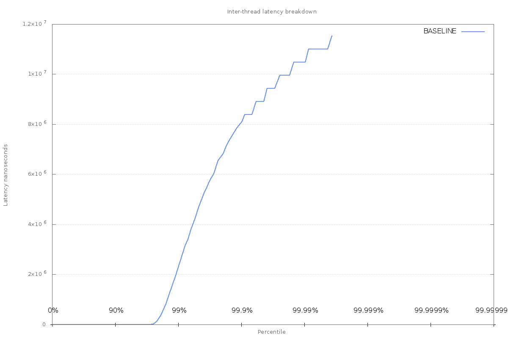
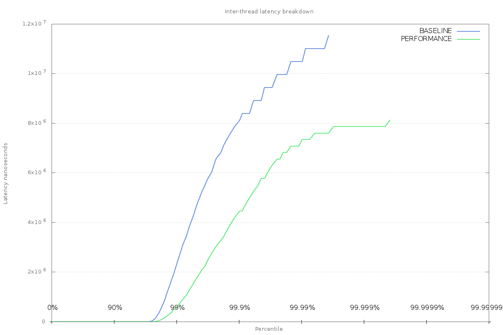
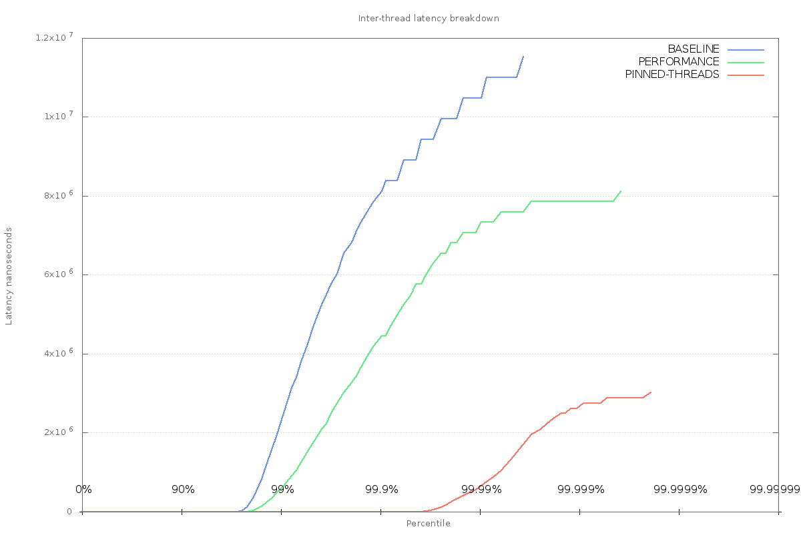
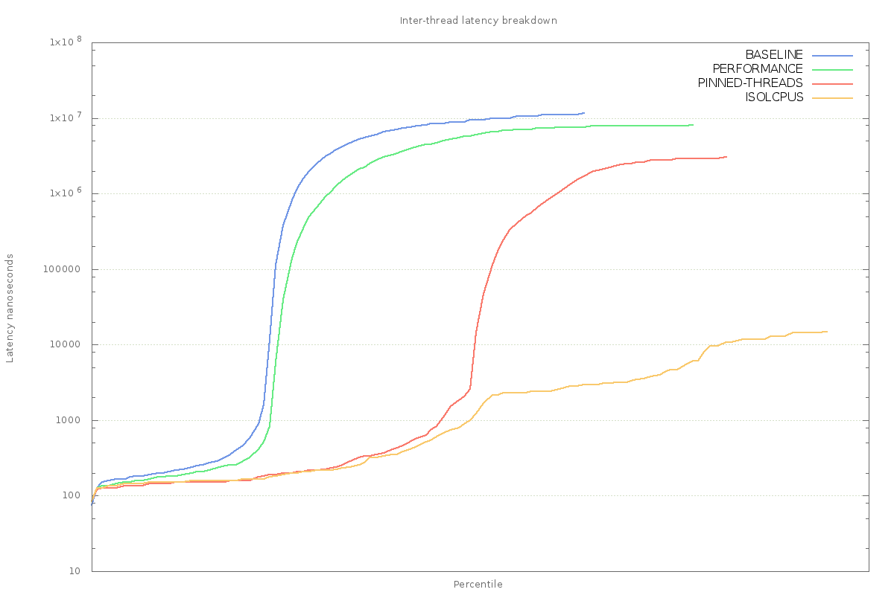

System Jitter Utility
=====================

A test program for exploring causes of jitter.

The application
===============

The application consists of 3 threads:

1. The producer thread - responsible for reading data from a memory-mapped file, inserting a timestamp, and publishing messages onto a queue (an instance of the [Disruptor] (https://github.com/LMAX-Exchange/disruptor)).
2. The accumulator thread - records a timestamp when it pulls a message from the queue, and stores the queue transit latency in a histogram.
3. The journaller thread - records a timestamp when it pulls a message from the queue, writes an entry to a journal containing the queue transit latency.

All timestamps are generated by calling `System.nanoTime()`.

The producer thread will busy-spin for ten microseconds between each publication. Consumer threads are busy-waiting on the head of the queue for messages to arrive from the producer.

The application is garbage-free, and [guaranteed safepoints] (https://epickrram.blogspot.co.uk/2015/08/jvm-guaranteed-safepoints.html) are disabled, so there should be no jitter introduced by the JVM itself.

Four latencies are recorded:

1. Queue transit time for accumulator thread
2. Queue transit time for journaller thread
3. Inter-message time for accumulator thread
4. Inter-message time for journaller thread

On system exit, full histograms of these values are generated for post-processing (placed in `/tmp/` by default). 

Requirements
============

1. JDK 8+

Tools to install
================

Install the following tools in order to work through the exercises:

1. gnuplot
2. perf
3. hwloc
4. trace-cmd
5. powertop

Using
=====

1. Clone this git repository
2. Build the library: `./gradlew bundleJar`
3. Run it: `cd src/main/shell && bash ./run_test.sh BASELINE`

Output
======

The `run_test.sh` script will run the application, using 'BASELINE' as a label. At exit, the application will print out a number of latency histograms.

Below is an excerpt of the output containing the histogram of latencies recorded between the producer thread and the accumulator thread.

    == Accumulator Message Transit Latency (ns) ==
    mean                   60879
    min                       76
    50.00%                   168
    90.00%                   256
    99.00%               2228239
    99.90%               8126495
    99.99%              10485823
    99.999%             11534399
    99.9999%            11534399
    max                 11534399
    count                3595101

So for this run, 3.5m messages were passed through the queue, the mean latency was around 60 microseconds, 
min latency was 75 nanoseconds, and the max latency was over 11 milliseconds.

These numbers can be plotted on a chart using the following command, executed from `src/main/shell`:

`bash ./chart_accumulator_message_transit_latency.sh`

and viewed with the following command:

`gnuplot ./accumulator_message_transit_latency.cmd`

producing something that looks like this chart:

Why so slow?
============

From these first results, we can see that at the 99th percentile, inter-thread latency was over 2 milliseconds, 
meaning that 1 in 100 messages took 2ms or longer to transit between two threads.

Since no other work is being done by this program, the workload is constant, and there are no runtime pauses, 
where is this jitter coming from?

Below are a series of steps working through some causes of system jitter on a modern Linux kernel 
(my laptop is running Fedora 22 on kernel 4.0.4).  Most of these techniques have been tested on a 3.18 kernel, 
older versions may not have the same features/capabilities.

CPU speed
=========

Modern CPUs (especially on laptops) are designed to be power efficient, this means that the OS will typically try 
to scale down the clock rate when there is no activity. On Intel CPUs, this is partially handled using power-states,
which allow the OS to reduce CPU frequency, meaning less power draw, and less thermal overhead.

On current kernels, this is handled by the CPU scaling governor. You can check your current setting by looking in the file

`/sys/devices/system/cpu/cpu0/cpufreq/scaling_governor`

on my laptop, this is set to `powersave` mode. To see available governors:

`cat /sys/devices/system/cpu/cpu0/cpufreq/scaling_available_governors`

which tells me that I have two choices:

1. performance
2. powersave

Before making a change though, let's make sure that powersave is actually causing us issues.

To do this, we can use [perf_events] (https://perf.wiki.kernel.org/index.php/Main_Page) 
to monitor the CPU's P-state while the application is running:
 
`perf record -e "power:cpu_frequency" -a`
 
This command will sample the cpu_frequency trace point written to by the intel cpufreq driver on all CPUs. This information comes
from an MSR on the chip which holds the FSB speed.

Hit Ctrl+c once the application has finished running, then use `perf script` to view the available output.

Filtering entries to include only those samples taken when `java` was executing shows some variation in the reported frequency:

    java  2804 [003]  3327.796741: power:cpu_frequency: state=1500000 cpu_id=3
    java  2804 [003]  3328.089969: power:cpu_frequency: state=3000000 cpu_id=3
    java  2804 [003]  3328.139009: power:cpu_frequency: state=2500000 cpu_id=3
    java  2804 [003]  3328.204063: power:cpu_frequency: state=1000000 cpu_id=3

Set the scaling governor to performance mode to reduce this:

`sudo bash ./set_cpu_governor.sh performance`

and re-run the test while using `perf` to record `cpu_frequency` events. If the change has taken effect, 
there should be no events output by `perf script`.

Running the test again with the performance governor enabled produces better results for inter-thread latency:

    == Accumulator Message Transit Latency (ns) ==
    mean                   23882
    min                       84
    50.00%                   152
    90.00%                   208
    99.00%                589827
    99.90%               4456479
    99.99%               7340063
    99.999%              7864351
    99.9999%             8126495
    max                  8126495
    count                3595101

Though there is still a max latency of 8ms, it has been reduced from the previous value of 11ms.

The effect is clearly visible when added to the chart. To add the new data, go through the steps followed earlier:

`bash ./chart_accumulator_message_transit_latency.sh`
`gnuplot ./accumulator_message_transit_latency.cmd`

Process migration
=================

Another possible cause of scheduling jitter is likely to be down to the OS scheduler moving processes around as different tasks 
become runnable. The important threads in the application are at the mercy of the scheduler, which can, at any time
decide to run another process on the current CPU. When this happens, the running thread's context will be saved, and it will
be shifted back into the schedulers run-queue (or possibly migrated to another CPU entirely).

To find out whether this is happening to the threads in our application, we can turn to `perf` again and sample trace events
emitted by the scheduler. First, record the PIDs of the two important threads from the application (producer and accumulator):

    Starting replay at Thu Sep 24 14:17:31 BST 2015
    Accumulator thread has pid: 11372
    Journaller thread has pid: 11371
    Producer thread has pid: 11370
    Warm-up complete at Thu Sep 24 14:17:35 BST 2015
    Pausing for 10 seconds...

Once warm-up has completed, record the scheduler events for the specific PIDs of interest:

`perf record -e "sched:sched_stat_runtime" -t 11370 -t 11372`

This command will record events emitted by the scheduler to update a task's runtime statistics. The recording session will exit once those processes complete. Running `perf script` again will show the captured events:

`java 11372 [001]  3055.140623: sched:sched_stat_runtime: comm=java pid=11372 runtime=1000825 [ns] vruntime=81510486145 [ns]`

The line above shows, among other things, what CPU the process was executing on when stats were updated. In this case, the process was running on CPU 001. A bit of sorting and counting will show exactly how the process was moved around the available CPUs during its lifetime:

`perf script | grep "java 11372" | awk '{print $3}' | sort | uniq -c`

    16071 [000]
    10858 [001]
     5778 [002]
     7230 [003]

So this thread mostly ran on CPUs 0 and 1, but also spent some time on CPUs 2 and 3. Moving the process around is going to require a context switch, and cache invalidation effects. While these are unlikely to be the sources of maximum latency, in order to start improving the worst-case, it will be necessary to stop migration of these processes.

The application allows the user to select a target CPU for any of the three processing threads via a config file `/tmp/perf-workshop.properties`. Edit the file, and select two different CPUs for the producer and accumulator threads:

    perf.workshop.affinity.producer=1
    perf.workshop.affinity.accumulator=3

Re-running the test shows a large improvement:

This result implies that forcing the threads to run on a single CPU can help reduce inter-thread latency. Whether this is down to the scheduler making better decisions about where to run other processes, or simple because there is less context switching is not clear.

One thing to look out for is the fact that we have not stopped the scheduler from running other tasks on those CPUs. We are still seeing multi-millisecond delays in message passing, and this could be down to other processes being run on the CPU that the application thread has been restricted to.

Returning to `perf` and this time capturing all `sched_stat_runtime` events for a specific CPU (in this case 1) will show what other processes are being scheduled while the application is running:

`perf record -e "sched:sched_stat_runtime" -C 1`

Stripping out everything but the process name, and counting occurrences in the event trace shows that while the java application was running most of the time, there are plenty of other processes that were scheduled during the application's execution time:

    45514 java
       60 kworker/1:2
       26 irq/39-DLL0665:
       24 rngd
       15 rcu_sched
        9 gmain
        8 goa-daemon
        7 chrome
        6 ksoftirqd/1
        5 rtkit-daemon

CPU Isolation
=============

At this point, it's time to remove the target CPUs from the OS's scheduling domain. This can be done with the `isolcpus` boot parameter (i.e. add `isolcpus=1,3` to `grub.conf`), or by using the `cset` command from the `cpuset` package.

In this case, I'm using isolcpus to stop the scheduler from running other userland processes on CPUs 1 & 3. The difference in inter-thread latency is dramatic:

    == Accumulator Message Transit Latency (ns) ==
    mean                     144
    min                       84
    50.00%                   144
    90.00%                   160
    99.00%                   208
    99.90%                   512
    99.99%                  2432
    99.999%                 3584
    99.9999%               11776
    max                    14848
    count                3595101

The difference is so great, that it's necessary to use a log-scale for the y-axis of the chart.

Note that the difference will not be so great on a server-class machine with lots of spare processing power. The effect here is magnified by the fact that the OS only has 4 CPUs (on my laptop) to work with, and a desktop distribution of Linux. So there is much more scheduling pressure than would be present on a server-class machine.

Using `perf` once again to confirm that other processes are not running on the reserved CPUs shows that there is still some contention to deal with:

    81130 java
        2 ksoftirqd/1
       43 kworker/1:0
        1 kworker/1:1H
        2 kworker/3:1
        1 kworker/3:1H
       11 swapper

These processes starting with 'k' are kernel threads that deal with house-keeping tasks on behalf of the OS, 'swapper' is the Linux idle process, which is scheduled whenever there is no work to be executed on a CPU.

